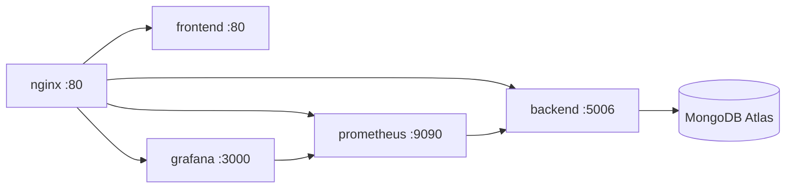

# TeamSync — Complete Codebase Architecture Report

> **Project**: TeamSync — End-to-End DevOps Pipeline for a SaaS Application  
> **Author**: Tarun Shetty | MCA Internship Project  
> **Stack**: React 18 · Node.js · Express · MongoDB Atlas · Docker · Nginx · Prometheus · Grafana · GitHub Actions · AWS EC2

---

## 1. High-Level System Architecture

```
┌──────────────────────────────────────────────────────────────────────┐
│                         USERS  (Browser)                             │
└───────────────────────────────┬──────────────────────────────────────┘
                                │  HTTP :80
┌───────────────────────────────▼──────────────────────────────────────┐
│                      NGINX REVERSE PROXY                             │
│           (Rate Limiting · Security Headers · Routing)               │
├──────────┬───────────┬──────────────┬───────────────┬───────────────┤
│  /       │  /api/*   │  /metrics    │  /grafana/*   │ /prometheus/* │
│  ▼       │  ▼        │  ▼           │  ▼            │  ▼            │
│ Frontend │ Backend   │ Backend      │ Grafana       │ Prometheus    │
│ (React)  │ (Express) │ /metrics     │ (:3000)       │ (:9090)       │
│ :80      │ :5006     │              │               │               │
└──────────┴─────┬─────┴──────────────┴───────────────┴───────────────┘
                 │                          ▲
     ┌───────────▼───────────┐    ┌─────────┴──────────┐
     │   MongoDB Atlas       │    │   Prometheus        │
     │   (Cloud Database)    │    │   scrapes /metrics  │
     └───────────────────────┘    │   every 15 s        │
                                  └─────────┬──────────┘
                                            │
                                  ┌─────────▼──────────┐
                                  │   Grafana           │
                                  │   Dashboards        │
                                  └────────────────────┘
```

### Request Flow (step-by-step)

1. **Browser → Nginx** — All traffic enters on port 80.
2. **Nginx routing** — path-based upstream selection (`/` → frontend, `/api/*` → backend, `/grafana/*` → Grafana, `/prometheus/*` → Prometheus).
3. **Frontend** — React SPA served by an internal Nginx container; client-side routing via `react-router-dom`.
4. **Backend** — Express REST API authenticates via JWT, queries MongoDB Atlas.
5. **Metrics** — `prom-client` exposes `/metrics`; Prometheus scrapes every 15 s; Grafana visualises.
6. **CI/CD** — GitHub Actions builds, tests, and deploys to AWS EC2 on every push to `main`.

---

## 2. Complete File Tree (34 source files)

```
teamsync-devops/
├── .env                              # Root env vars (MongoDB URI, JWT secret, Grafana creds)
├── .env.example                      # Template for .env
├── .gitignore                        # Ignores: node_modules, .env, dist, volumes, logs
├── README.md                         # Full project documentation (423 lines)
├── docker-compose.yml                # 5-service orchestration (118 lines)
│
├── frontend/                         # ── React + Vite Frontend ──────────────
│   ├── index.html                    # HTML shell — loads Inter font, mounts #root
│   ├── package.json                  # React 18, react-router-dom 6, Vite 5
│   ├── vite.config.js                # Dev server :3000, proxy /api → :5006
│   ├── Dockerfile                    # Multi-stage: Node build → Nginx serve
│   ├── nginx.conf                    # SPA fallback (try_files), static caching
│   └── src/
│       ├── main.jsx                  # ReactDOM.createRoot, BrowserRouter
│       ├── App.jsx                   # Auth state, routing (Login ↔ Dashboard)
│       ├── App.css                   # Loading spinner
│       ├── index.css                 # Design system: CSS variables, reset, animations
│       ├── components/
│       │   ├── Sidebar.jsx           # Navigation with SVG icons, user profile
│       │   └── Sidebar.css           # Glassmorphism sidebar, 260px fixed
│       └── pages/
│           ├── Login.jsx             # Login/Register form, demo fallback
│           ├── Login.css             # Animated orbs, glassmorphism card
│           ├── Dashboard.jsx         # Stats, activity, team, pipeline, infra
│           └── Dashboard.css         # Grid layout, cards, pipeline visualisation
│
├── backend/                          # ── Node.js + Express Backend ──────────
│   ├── .env                          # Local env (PORT=5987, MongoDB URI)
│   ├── .env.example                  # Template
│   ├── package.json                  # express, mongoose, bcryptjs, jsonwebtoken,
│   │                                 #   prom-client, cors, morgan, dotenv
│   ├── Dockerfile                    # node:18-alpine, non-root user, healthcheck
│   └── src/
│       ├── index.js                  # Server entry: middleware chain, DB connect, listen
│       ├── middleware/
│       │   ├── auth.js               # JWT verification middleware
│       │   └── metrics.js            # prom-client: Counter, Histogram, Gauge
│       ├── models/
│       │   └── User.js               # Mongoose schema, bcrypt pre-save hook
│       └── routes/
│           ├── auth.js               # POST /register, POST /login, GET /profile
│           ├── dashboard.js          # GET /stats, /activity, /team (sample data)
│           └── health.js             # GET / — uptime, memory, DB status
│
├── nginx/                            # ── Reverse Proxy ──────────────────────
│   └── nginx.conf                    # Upstreams, rate-limiting, security headers,
│                                     #   proxy rules for all 4 upstreams
│
├── monitoring/                       # ── Observability ──────────────────────
│   ├── prometheus/
│   │   └── prometheus.yml            # 3 scrape jobs: self, backend, nginx
│   └── grafana/
│       ├── dashboards/
│       │   └── dashboard.json        # 6 panels: request rate, p95, connections,
│       │                             #   total requests, memory, event loop lag
│       └── provisioning/
│           ├── datasources/
│           │   └── datasource.yml    # Prometheus as default datasource
│           └── dashboards/
│               └── dashboard.yml     # Auto-load from /var/lib/grafana/dashboards
│
└── .github/
    └── workflows/
        └── deploy.yml                # 3-job pipeline: build-test → docker → deploy
```

---

## 3. Frontend Architecture

### 3.1 Technology & Build

| Aspect | Detail |
|--------|--------|
| **Framework** | React 18.2 with JSX |
| **Build Tool** | Vite 5.0 (`@vitejs/plugin-react`) |
| **Routing** | `react-router-dom` v6 — `BrowserRouter`, `Routes`, `Route`, `Navigate` |
| **Styling** | Vanilla CSS with CSS custom properties (design tokens) |
| **Typography** | Google Fonts — Inter (weights 300–800) |
| **Design Language** | Dark mode, glassmorphism, gradient accents, micro-animations |
| **Dev Server** | Port 3000, proxies `/api` → `http://localhost:5006` |
| **Production** | Vite builds to `dist/`, served by Nginx inside Docker |

### 3.2 Component Hierarchy

```
<BrowserRouter>                         ← main.jsx
  <App>                                 ← App.jsx (auth state manager)
    ├── <Login onLogin={…} />           ← pages/Login.jsx  (route: /login)
    └── <Dashboard user={…} onLogout={…}>  ← pages/Dashboard.jsx (route: /dashboard)
           └── <Sidebar … />            ← components/Sidebar.jsx
```

### 3.3 Authentication Flow (Client-Side)

1. `App.jsx` checks `localStorage` for `teamsync_token` and `teamsync_user` on mount.
2. If present → `isAuthenticated = true` → redirect to `/dashboard`.
3. `Login.jsx` calls `POST /api/auth/login` or `/register`; on success stores token + user in localStorage via `onLogin()`.
4. **Demo fallback**: If the backend is unreachable, credentials `demo@teamsync.io / demo123` auto-login with a hardcoded demo user.
5. Logout clears localStorage and resets state.

### 3.4 Design System (index.css)

The CSS design system defines **30+ CSS custom properties** organised into:

- **Color palette**: `--color-bg-primary` (#0a0e1a), `--color-accent` (#6366f1), success/warning/danger/info
- **Gradients**: `--gradient-primary` (indigo → purple), `--gradient-card`
- **Shadows**: 4 levels (sm, md, lg, glow)
- **Border radii**: 4 sizes (sm=8px, md=12px, lg=16px, xl=24px)
- **Transitions**: 3 speeds (fast=150ms, normal=250ms, slow=400ms cubic-bezier)
- **Animations**: fadeIn, slideIn, pulse, shimmer, float — used for loading states and ambient effects

### 3.5 Frontend Dockerfile (Multi-Stage)

```
Stage 1 (node:18-alpine) — Build
  ├── npm ci
  └── npm run build → /app/dist

Stage 2 (nginx:alpine) — Serve
  ├── Copy custom nginx.conf (SPA routing)
  ├── Copy /app/dist → /usr/share/nginx/html
  ├── Expose :80
  └── Healthcheck: wget localhost:80
```

Key optimisations in `frontend/nginx.conf`:
- `try_files $uri $uri/ /index.html` — SPA client-side routing support
- Static assets cached for **1 year** with `Cache-Control: public, immutable`
- Security headers: X-Frame-Options, X-Content-Type-Options, X-XSS-Protection

---

## 4. Backend Architecture

### 4.1 Technology

| Aspect | Detail |
|--------|--------|
| **Runtime** | Node.js 18 (Alpine) |
| **Framework** | Express 4.18 |
| **Database** | MongoDB Atlas via Mongoose 7.6 |
| **Auth** | JWT (jsonwebtoken 9.0) + bcryptjs 2.4 |
| **Monitoring** | prom-client 15.0 (Prometheus metrics) |
| **Logging** | Morgan (combined format) |
| **Port** | 5006 (Docker Compose) / 5987 (local dev) |

### 4.2 Middleware Pipeline

```
Request → cors() → express.json() → morgan('combined') → metricsMiddleware → Route Handler
```

Each middleware in order:
1. **CORS** — Allows cross-origin requests from the frontend.
2. **JSON Parser** — Parses `application/json` request bodies.
3. **Morgan** — Logs HTTP requests in Apache combined format.
4. **Prometheus Metrics** — Increments counters, records latency histograms, tracks active connections.

### 4.3 Route Map

| Method | Endpoint | Auth | Handler | Description |
|--------|----------|------|---------|-------------|
| POST | `/api/auth/register` | No | `routes/auth.js` | Create user, return JWT |
| POST | `/api/auth/login` | No | `routes/auth.js` | Validate credentials, return JWT |
| GET | `/api/auth/profile` | Yes | `routes/auth.js` | Return user (minus password) |
| GET | `/api/dashboard/stats` | Yes | `routes/dashboard.js` | SaaS metrics (sample data) |
| GET | `/api/dashboard/activity` | Yes | `routes/dashboard.js` | Recent activity feed |
| GET | `/api/dashboard/team` | Yes | `routes/dashboard.js` | Team members list |
| GET | `/api/health` | No | `routes/health.js` | Server health + DB status |
| GET | `/api` | No | `index.js` | API info + endpoint list |
| GET | `/metrics` | No | `middleware/metrics.js` | Prometheus exposition format |

### 4.4 Data Model — User Schema

```javascript
{
  name:      String  (required, 2–50 chars),
  email:     String  (required, unique, regex-validated),
  password:  String  (required, min 6 chars, bcrypt-hashed),
  role:      Enum    ['admin', 'user', 'viewer'] (default: 'user'),
  createdAt: Date    (default: Date.now)
}
```

**Pre-save hook**: Hashes password with bcrypt (10 salt rounds) before insert.  
**Instance method**: `comparePassword(candidate)` — bcrypt.compare for login.

### 4.5 JWT Authentication

- **Signing**: `jwt.sign({ id, email, name, role }, JWT_SECRET, { expiresIn: '24h' })`
- **Verification**: `auth.js` middleware extracts `Bearer <token>` from `Authorization` header, calls `jwt.verify()`, attaches decoded payload to `req.user`.
- **Error handling**: Differentiates `TokenExpiredError` (401 + "expired") from generic invalid tokens.

### 4.6 Prometheus Metrics (metrics.js)

Three custom metrics registered:

| Metric | Type | Labels | Description |
|--------|------|--------|-------------|
| `http_requests_total` | Counter | method, route, status_code | Total HTTP requests |
| `http_request_duration_seconds` | Histogram | method, route, status_code | Latency distribution (9 buckets: 1ms–5s) |
| `active_connections` | Gauge | — | Currently active connections |

Plus **default Node.js metrics** (CPU, memory, GC, event loop) via `client.collectDefaultMetrics()`.

The `/metrics` endpoint skips self-instrumentation to prevent recursion.

### 4.7 Health Check Endpoint

Returns comprehensive status:
- Server status, uptime, Node.js version
- Database connection state (`mongoose.connection.readyState`)
- Memory usage (RSS, heapUsed, heapTotal in MB)

Always returns HTTP 200 (server is functional even without DB for demo mode).

### 4.8 Backend Dockerfile

```
FROM node:18-alpine
  ├── COPY package*.json → npm ci --only=production
  ├── COPY . .
  ├── EXPOSE 5006
  ├── HEALTHCHECK (wget /api/health every 30s)
  ├── Create non-root user (nodejs:1001, nodeuser:1001)
  └── CMD ["node", "src/index.js"]
```

**Security**: Runs as non-root `nodeuser` (UID 1001).

---

## 5. Nginx Reverse Proxy Architecture

### 5.1 Upstream Definitions

```
frontend   → frontend:80
backend    → backend:5006
grafana    → grafana:3000
prometheus → prometheus:9090
```

### 5.2 Routing Rules

| Location | Upstream | Features |
|----------|----------|----------|
| `/api/*` | backend | Rate limiting (30 req/s, burst=20), WebSocket upgrade headers, 30s read timeout |
| `/metrics` | backend `/metrics` | Direct proxy for Prometheus scraping |
| `/grafana/*` | grafana | X-Forwarded-For header passthrough |
| `/prometheus/*` | prometheus | Basic proxy pass |
| `/` | frontend | WebSocket upgrade support for HMR |
| `/nginx_status` | stub_status | Restricted to localhost + 172.0.0.0/8 |

### 5.3 Security Headers

```
X-Frame-Options: SAMEORIGIN
X-Content-Type-Options: nosniff
X-XSS-Protection: 1; mode=block
Referrer-Policy: strict-origin-when-cross-origin
```

### 5.4 Rate Limiting

```nginx
limit_req_zone $binary_remote_addr zone=api:10m rate=30r/s;
```
Applied to `/api/*` with `burst=20 nodelay` — prevents API abuse while handling traffic spikes.

---

## 6. Docker & Container Orchestration

### 6.1 Docker Compose Services (5 containers)



| Service | Image | Container Name | Port Mapping | Volumes |
|---------|-------|---------------|--------------|---------|
| frontend | Custom (Dockerfile) | teamsync-frontend | internal :80 | — |
| backend | Custom (Dockerfile) | teamsync-backend | internal :5006 | — |
| nginx | nginx:alpine | teamsync-nginx | **80:80** | `nginx.conf` (read-only) |
| prometheus | prom/prometheus:latest | teamsync-prometheus | **9090:9090** | `prometheus.yml` (ro), named volume |
| grafana | grafana/grafana:latest | teamsync-grafana | **3001:3000** | provisioning + dashboards (ro), named volume |

### 6.2 Networking

- **Bridge network**: `teamsync-network` — all 5 containers communicate via DNS names.
- Only **nginx** (:80), **prometheus** (:9090), and **grafana** (:3001) are exposed to the host.
- Frontend and backend are **not directly accessible** from outside — traffic must go through Nginx.

### 6.3 Named Volumes

| Volume | Purpose |
|--------|---------|
| `teamsync-prometheus-data` | TSDB storage (7-day retention) |
| `teamsync-grafana-data` | Grafana DB, plugins, settings |

### 6.4 Health Checks

All custom containers define Docker-level health checks:
- **Frontend**: `wget localhost:80/` every 30s
- **Backend**: `wget localhost:5006/api/health` every 30s
- Both: 5s timeout, 3 retries

### 6.5 Environment Variables

| Variable | Source | Used By |
|----------|--------|---------|
| `MONGODB_URI` | `.env` | backend |
| `JWT_SECRET` | `.env` | backend |
| `NODE_ENV` | docker-compose.yml | backend (hardcoded: production) |
| `PORT` | docker-compose.yml | backend (hardcoded: 5006) |
| `GF_SECURITY_ADMIN_USER` | docker-compose.yml | grafana |
| `GF_SECURITY_ADMIN_PASSWORD` | docker-compose.yml | grafana |
| `GF_USERS_ALLOW_SIGN_UP` | docker-compose.yml | grafana (false) |

---

## 7. Monitoring & Observability

### 7.1 Prometheus Configuration

```yaml
global:
  scrape_interval: 15s
  evaluation_interval: 15s
```

**Scrape Targets:**

| Job | Target | Path | Interval |
|-----|--------|------|----------|
| prometheus | localhost:9090 | /metrics | 15s |
| teamsync-backend | backend:5006 | /metrics | 10s |
| nginx | nginx:80 | /nginx_status | 30s |

Storage: TSDB with **7-day retention**, lifecycle API enabled for hot-reload.

### 7.2 Grafana Setup

**Auto-provisioned** on startup via YAML files:

- **Datasource**: Prometheus at `http://prometheus:9090` (default, proxy mode)
- **Dashboard**: Auto-loaded from `/var/lib/grafana/dashboards`

### 7.3 Pre-Built Dashboard (6 Panels)

| Panel | Type | PromQL Query |
|-------|------|-------------|
| HTTP Request Rate | timeseries | `rate(http_requests_total[5m])` |
| Response Time (p95) | timeseries | `histogram_quantile(0.95, rate(http_request_duration_seconds_bucket[5m]))` |
| Active Connections | stat | `active_connections` |
| Total Requests | stat | `http_requests_total` |
| Memory Usage (MB) | gauge | `process_resident_memory_bytes / 1024 / 1024` |
| Event Loop Lag | timeseries | `nodejs_eventloop_lag_seconds` |

### 7.4 Metrics Data Flow

```
Backend (prom-client) → exposes /metrics
        ↓
Prometheus scrapes every 10–15s → stores in TSDB
        ↓
Grafana queries Prometheus → renders dashboards
```

---

## 8. CI/CD Pipeline (GitHub Actions)

### 8.1 Trigger

```yaml
on:
  push:    branches: [main]
  pull_request: branches: [main]
```

### 8.2 Three-Job Pipeline

```
┌─────────────────┐     ┌─────────────────┐     ┌─────────────────┐
│  Build & Test   │────▶│  Docker Build    │────▶│  Deploy to EC2  │
│  (ubuntu-latest)│     │  (ubuntu-latest) │     │  (ubuntu-latest)│
└─────────────────┘     └─────────────────┘     └─────────────────┘
```

**Job 1 — Build & Test:**
- Checkout code
- Setup Node.js 18 with npm cache
- `npm ci` for both frontend and backend
- `npm run build` for frontend (Vite production build)

**Job 2 — Docker Build** (depends on Job 1):
- Setup Docker Buildx
- Build frontend image: `teamsync-frontend:<sha>`
- Build backend image: `teamsync-backend:<sha>`
- Validate `docker compose config`

**Job 3 — Deploy** (depends on Job 2, only on `push` to `main`):
- SSH into EC2 via `appleboy/ssh-action`
- `git pull origin main`
- Write `.env` from GitHub Secrets
- `docker compose down` → `build --no-cache` → `up -d`
- Health check: `curl localhost/api/health`
- Cleanup: `docker image prune -f`
- Post-deployment verification: container status + health check

### 8.3 Required GitHub Secrets

| Secret | Purpose |
|--------|---------|
| `EC2_HOST` | EC2 public IP |
| `EC2_USERNAME` | SSH user (ubuntu) |
| `EC2_SSH_KEY` | PEM key contents |
| `MONGODB_URI` | Atlas connection string |
| `JWT_SECRET` | JWT signing key |

---

## 9. Cloud Deployment (AWS EC2)

### 9.1 Infrastructure

- **Instance**: Ubuntu 22.04 LTS (t2.micro free tier)
- **Runtime**: Docker + Docker Compose installed on EC2
- **Project path**: `/home/ubuntu/teamsync`

### 9.2 Security Group Rules

| Port | Protocol | Source | Service |
|------|----------|--------|---------|
| 22 | TCP | Your IP | SSH |
| 80 | TCP | Anywhere | Nginx (application) |
| 3001 | TCP | Anywhere | Grafana |
| 9090 | TCP | Anywhere | Prometheus |

### 9.3 Deployment Flow

```
Developer pushes to main
  → GitHub Actions triggers
    → Build & test code
      → Build Docker images
        → SSH into EC2
          → git pull + docker compose rebuild
            → Health check verification
```

---

## 10. Security Architecture

| Layer | Mechanism |
|-------|-----------|
| **Authentication** | JWT tokens (24h expiry), bcrypt password hashing (10 rounds) |
| **API Protection** | Bearer token middleware on protected routes |
| **Rate Limiting** | Nginx `limit_req_zone` — 30 req/s per IP with burst=20 |
| **HTTP Security** | X-Frame-Options, X-Content-Type-Options, X-XSS-Protection, Referrer-Policy |
| **Container Security** | Backend runs as non-root user (UID 1001) |
| **Secret Management** | `.env` files excluded via `.gitignore`; GitHub Secrets for CI/CD |
| **Network Isolation** | Only Nginx exposed externally; frontend/backend on internal Docker network |
| **Input Validation** | Mongoose schema validation (email regex, min/max lengths, required fields) |
| **Password Security** | Passwords never returned in API responses (`select('-password')`) |

---

## 11. Dependency Summary

### Frontend (package.json)

| Package | Version | Purpose |
|---------|---------|---------|
| react | ^18.2.0 | UI library |
| react-dom | ^18.2.0 | DOM rendering |
| react-router-dom | ^6.20.0 | Client-side routing |
| vite | ^5.0.0 | Build tool (dev) |
| @vitejs/plugin-react | ^4.2.0 | React Fast Refresh (dev) |

### Backend (package.json)

| Package | Version | Purpose |
|---------|---------|---------|
| express | ^4.18.2 | HTTP framework |
| mongoose | ^7.6.3 | MongoDB ODM |
| bcryptjs | ^2.4.3 | Password hashing |
| jsonwebtoken | ^9.0.2 | JWT auth |
| prom-client | ^15.0.0 | Prometheus metrics |
| cors | ^2.8.5 | Cross-origin support |
| morgan | ^1.10.0 | HTTP logging |
| dotenv | ^16.3.1 | Environment variables |
| nodemon | ^3.0.1 | Hot-reload (dev) |

---

## 12. Key Design Decisions

| Decision | Rationale |
|----------|-----------|
| **Vite over CRA** | Faster HMR, smaller bundles, native ESM support |
| **Multi-stage Docker builds** | Minimal production images (nginx:alpine for frontend) |
| **MongoDB Atlas over local Mongo** | Zero infrastructure management, free tier, built-in backups |
| **prom-client over custom metrics** | Industry-standard Prometheus exposition format |
| **Nginx as reverse proxy** | Single entry point, rate limiting, security headers, service routing |
| **Demo fallback data** | App remains functional even without backend/DB connectivity |
| **Bridge network** | Container DNS resolution, network isolation from host |
| **GitHub Actions over Jenkins** | Zero infrastructure, native GitHub integration, YAML-based |
| **SSH deployment over ECS/EKS** | Simpler for demo; direct `docker compose` on EC2 |
| **CSS custom properties** | Consistent theming without a CSS framework dependency |

---

## 13. Port Reference

| Port | Service | Exposure |
|------|---------|----------|
| 80 | Nginx reverse proxy | **Host** (main entry point) |
| 80 | Frontend (internal Nginx) | Docker internal only |
| 3000 | Vite dev server | Local development only |
| 3000 | Grafana (internal) | Docker internal |
| 3001 | Grafana | **Host** mapped from :3000 |
| 5006 | Backend (Docker) | Docker internal only |
| 5987 | Backend (local dev) | Local development only |
| 9090 | Prometheus | **Host** |
