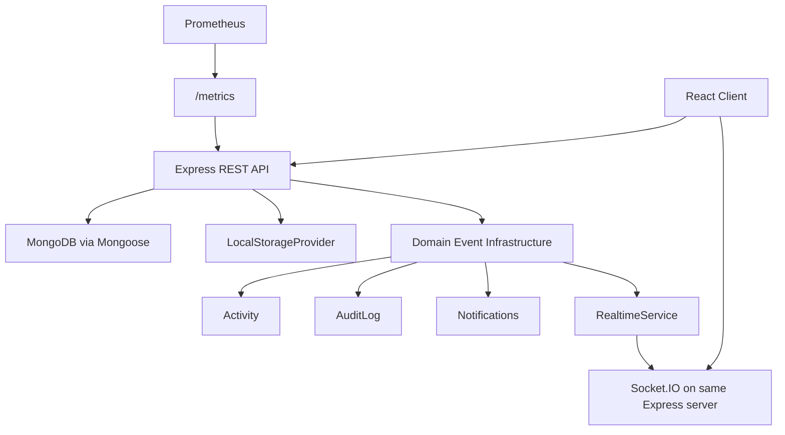

# TeamSync Final Architecture Review

## Current Product Scope

TeamSync is a workspace-scoped project management SaaS with authentication, Google OAuth, secure sessions, RBAC, workspaces, members, roles, projects, tasks, comments, files, notifications, profiles, advanced tasks, Kanban V2, search, realtime invalidation, dashboards, timeline, roadmap, Gantt, productivity, and enterprise governance.

Legacy Gemini, OTP, AI assistant, standalone Kanban, and standalone services are not part of the architecture.

## Runtime Architecture

## Production Boundaries

- REST remains authoritative for all writes.
- Socket.IO is invalidation-only for tasks, comments, notifications, and presence.
- Local storage is used for files and exports.
- MongoDB stores all domain data and governance records.
- Nginx terminates HTTPS and proxies API/client traffic.
- Prometheus/Grafana are internal monitoring services.

## Hardening Summary

- Added request logging and in-process HTTP metrics.
- Added liveness and readiness health endpoints.
- Added Prometheus-compatible `/metrics`.
- Tightened write, upload, search, and export rate limits.
- Protected public Nginx access to backend metrics.
- Added release indexes for audit, activity, and file listing paths.
- Split frontend vendor chunks and lazy-loaded attachment panels.
- Documented deployment, backup, recovery, performance, security, accessibility, and release gates.

## Beta Constraints

- Presence is in-memory and single-deployment scoped.
- Dashboard cache is in-memory and naturally expires.
- Exports are synchronous and should be monitored on very large workspaces.
- Retention cleanup runs in-process with a Mongo-backed lock.
