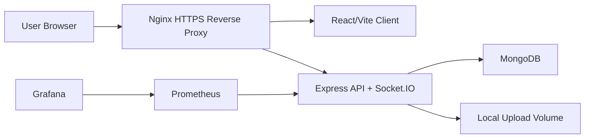

# TeamSync Production Deployment Guide

## Architecture



## Required Environment

Backend:

- `NODE_ENV=production`
- `PORT`
- `MONGO_URI`
- `SESSION_SECRET`
- `SESSION_EXPIRES_IN`
- `GOOGLE_CLIENT_ID`
- `GOOGLE_CLIENT_SECRET`
- `GOOGLE_CALLBACK_URL`
- `FRONTEND_ORIGIN`
- `FRONTEND_GOOGLE_CALLBACK_URL`
- `LOCAL_FILE_STORAGE_DIR`
- `MAX_ATTACHMENT_BYTES`
- `MAX_AVATAR_BYTES`

Client:

- `VITE_API_BASE_URL`

Monitoring:

- `GF_ADMIN_USER`
- `GF_ADMIN_PASSWORD`

TLS:

- `TLS_CERT_PATH`
- `TLS_KEY_PATH`

## Deployment Steps

1. Provision MongoDB and verify backup access.
2. Create production `.env` values outside git.
3. Install TLS certificate and key referenced by Docker Compose.
4. Build and start services:

```bash
docker compose build
docker compose up -d
```

5. Run migrations:

```bash
docker compose exec backend npm run migrate
```

6. Verify health:

```bash
docker compose ps
docker compose exec backend wget --spider http://localhost:8000/health/ready
```

7. Verify HTTPS:

```bash
curl -I https://teamsyncin.duckdns.org
curl -I https://teamsyncin.duckdns.org/api/health/ready
```

## Production Notes

- Public traffic must enter through Nginx over HTTPS.
- Backend, Prometheus, and Grafana should remain Docker-internal.
- `/api/metrics` is blocked by Nginx for public clients; Prometheus scrapes `backend:8000/metrics` internally.
- Docker backend health uses `/health/ready`, which fails if Mongo is disconnected.
- Run `git diff --check`, backend build/test/e2e, client lint/build before deployment.
